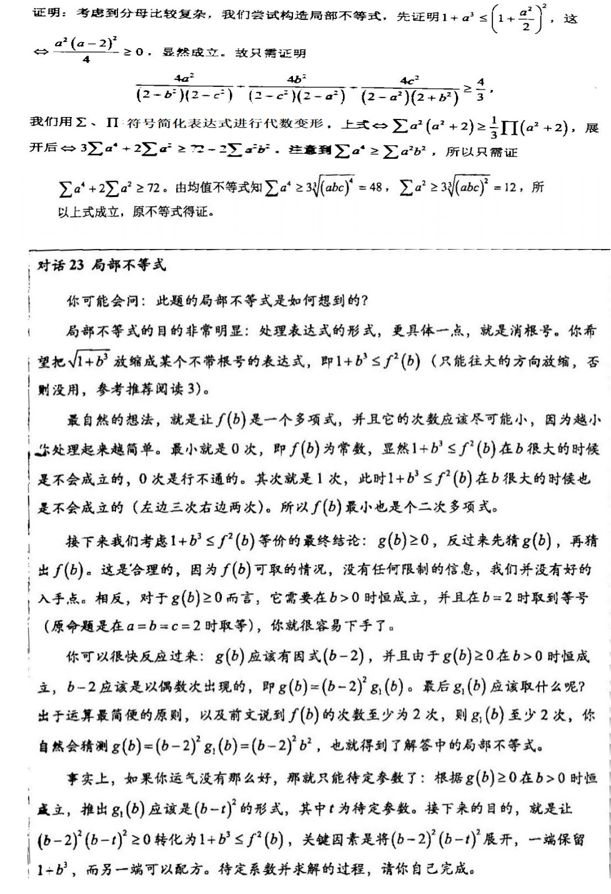

检索字：junzhibudengshi; Average inequality

## 前置知识

[和式](heshi.md) [平均值](pingjunzhi.md)

## 概念

### 基本定义

给定一组**正实数**$\{a_n\}$。

- 记$H_n=\dfrac{n}{\sum\dfrac1{a_j}}$为这组数的**调和平均值**。
- 记$G_n=(\prod a_j)^{1/n}$为这组数的**几何平均值**。
- 记$A_n=\dfrac1n\sum a_j$为这组数的**算术平均值**。
- 记$Q_n=\sqrt{\dfrac1n\sum a_j^2}$为这组数的**平方平均值**。

则有
$$
H_n\le G_n\le A_n\le Q_n
$$
上式称为**均值不等式**。当且仅当$a_1=...=a_n$时取等。

对于$n=2,a_1\not=a_2$，我们称$\dfrac{a_1-a_2}{\ln a_1-\ln a_2}$为$a_1,a_2$的**对数平均值**。此时有$G_2<\dfrac{a_1-a_2}{\ln a_1-\ln a_2}<A_2$。

### 证明

我们仅证明$G_n\le A_n$，其余留作练习。

采用[柯西归纳法](shuxueguinafa.md)完成。

$n=2$时，不等式显然成立。

简单归纳可以得到不等式对$n=2^k$成立，其中 k 为正整数。

对于非2整数幂的正整数 n，任取$2^k>n$，则由

$$
\dfrac{a_1+...+a_n+\overbrace{G_n+...+G_n}^{2^m-n个}}{2^m}\ge(G_n^nG_n^{2^m-n})^{1/2^m}=G_n
$$

得到$A_n\ge G_n$。故原不等式成立。

### 加权$AM-GM$不等式

设 n 个和为1点正实数$\{x_n\}$，则有

$$
\sum{a_jx_j\ge\prod a_j^{x_j}}
$$

#### 证明

采用[数学归纳法](shuxueguinafa.md)完成。

对$n=2$与$x_1,x_2\in\textbf{Q}$，显然。

若$x_1,x_2\in\textbf{R},x_1,x_2\not\in\textbf{Q}$，取有理序列$\{r_n\},\{s_n\}$满足$r_n\rightarrow x_1,s_n\rightarrow x_2$且$r_n+s_n=1$，则

$$
a_1r_n+a_2s_n\ge a_1^{r_n}a_2^{s_m}
$$

两边取极限即可。

对于一般的$n$，考虑第一数学归纳法。将问题转化到$n-1$元。

令正实数$b_{n-1}y_{n-1}=a_{n-1}x_{n-1}+a_nx_n$，并对$x_1,...,x_{n-2},y_{n-1}$与系数$a_1,...,a_{n-2},b_{n-1}$，有归纳假设

$$
a_1x_1+...+a_{n-2}x_{n-2}+b_{n-1}y_{n-1}\ge a_1^{x_1}...a_{n-2}^{x_{n-2}}b_{n-1}^{y_{n-1}}
$$

将 b 与 y 代入化简，再对右边最后一因式套用$n=2$的归纳假设来放缩，即证。

参考：[有理数命题到无理数命题](youlishumingtidaowulishumingti.md)

## 方法

Note：对于**最基础的几个例题**，选择二元不等式会使解答过于显然，但刚开始就选择 n 元不等式会显得有些突兀，前面的几个例题自然地就选择了三元不等式。而对于三元不等式**最基础的思路**自然是构造局部不等式，再“三式相加”。

为了方便，叙述时仅给出三式中一式，另外两式即其轮换。比如

“$x+y>z$，三式相加即证”表示$x+y>z$,$y+z>x$,$z+x>y$三式相加。

但有些不等式并不是轮换的，此时本文会明确写出三个式子，比如例4。

### 常规

**例1** 设 x,y,z 为正实数，求证：

$$
x^4+y^4+z^4\ge\dfrac12(x^3y+y^3z+z^3x+x^3z+z^3y+y^3x)\ge x^2y^2+z^2x^2\ge x^2yz+xy^2z+xyz^2
$$

**证明**

- 第一个不等号，由于$\dfrac12(x^4+y^4)-\dfrac12(x^3y+xy^3)=\dfrac12(x-y)^2(x^2+xy+y^2)\ge0$，故$\dfrac12(x^4+y^4)\ge\dfrac12(x^3y+xy^3)$，对$(x,y,z)$轮换还有类似两式，三式相加即证。
- 第二个不等号，由均值不等式，$\dfrac12(x^3y+xy^3)\ge x^2y^2$，类似地三式相加即证。
- 第三个不等号，由均值不等式，$\dfrac12(x^2y^2+x^2y^2)\ge x^2yz$，类似地三式相加即证。

### 系数配给与消分母、次数调整

均值不等式可以“**放和为积**”，因而用均值不等式来调整次数和消去分母，是很自然的操作。

#### 常规方法

**例2** 

对$x,y,z\in\textbf{R}$且$x,y,z\ge0$,满足$2x+3y+5z=6$，求$x^2yz$的最大值。  

**解答**

考虑利用均值不等式来将和（条件$2x+3y+5z$）放缩为积形式（要求的$x^2yz$）。注意到$x^2yz$中 x 的次数为2，将其拆分为$x*x*y*z$，而和$2x+3y+5z$自然相应地拆分为$x+x+3y+5z$。于是下面的过程就十分显然了。

$x^2yz=\dfrac1{15}(x*x*3y*5z)\le\dfrac1{15}(\dfrac{x+x+3y+5z}4)^4=\dfrac{27}{80}$。取等当且仅当$x=1.5,y=0.5,z=0.3$。

#### 次数调整

在例三之前，再次明确一下配给常数的目的。

一是在均值不等式中，我们猜出了取等条件。**为了让均值不等式的取等条件正确，需要配系数**。譬如我们要对$x+y$套用均值不等式，而取等条件是$x=1,y=2$，我们需要配给常数2给x，即$2x+y$。这样套用均值不等式后，取等条件即为$2x=y$。恰满足$x=1,y=2$时取等的要求。

二是调整次数。譬如对$x^5+1$，要将其降至$x^2$。我们配给常数$ax^5+b$后，若单纯地依然使用二元均值不等式，只是改变了根号底下的系数，毫无用处。

事实上，对此进行常数配给，**是要用 a 个$x^5$与 b 个 1，套用$a+b$元均值不等式**。由于5和2是互素的，我们首先把$x^5$升幂为2的倍数，由于$\gcd(5,2)=10$，比较显然的思路是令$a=2$。而又有$10/2=5$，这提示需要用5元均值。因而$b=5-a=2$。

其实在简单的次数调整中，完全可以直接写下若干个相同的项，例如例4。但有时**项数过多**，甚至要套用20元均值（例如**例3的第五小题**），**因而我们不得不用乘法来代替相同的项连加**，看起来就像是系数一样。这就导致了系数配给的歧义。希望这不会对你造成理解上的困难。

类似地，我们下文在配给系数的过程中，若提到“降次”“升幂”“调整次数”等，并写出$5\dfrac{x^4}{y^3}+3y^5$这样的式子，默认是指5个$\dfrac{x^4}{y^3}$和3个$y^5$来套用8元均值。而若提到“为了满足取等条件”等，则是目的一，是单纯地配系数。

有时会同时出现两种目的的系数配给，见例题5。

**例3** 设 x,y,z 为正实数：

(1) 求证：$\dfrac{x^2}y+\dfrac{y^2}z+\dfrac{z^2}x\ge x+y+z$  
(2) 求证：$\dfrac{x^3}{yz}+\dfrac{y^3}{zx}+\dfrac{z^3}{xy}\ge x+y+z$  
(3) $x^2+y^2+z^2=3$，求证：$x^3+y^3+z^3\ge3,x^{1.5}+y^{1.5}+z^{1.5}\le3$，并思考$x^{1.9}+y^{1.9}+z^{1.9}$与3的大小关系。  
(4) 求证：$x^3+y^3+z^3\ge x^2y+y^2z+z^2x\ge3xyz$。
(5) $x^5+y^5+z^5=3$，求证：$\dfrac{x^4}{y^3}+\dfrac{y^4}{z^3}+\dfrac{z^4}{x^3}\ge3$

**证明**

(1) 由$\dfrac{x^2}y+y\ge2x$三式相加即证。

(2) 注意到左侧的分子皆为三次式，而右侧为一次式，考虑利用三元均值不等式将三次降为一次并消去分母。由$\dfrac{x^3}{yz}+y+z\ge3x$三式相加即证。

(3) 为了利用到条件，考虑使用均值不等式将三次式降为二次。不难想到$2=3*2/3$，用均值不等式$x^3+x^3+1\ge3x^2$，三式相加即证第一问。对于第二问，$1.5=3/2$，用均值不等式$x^3+1\ge2x^{1.5}$即可。对于第三问，考虑配常数 k 并用均值不等式$kx^2+1\ge(k+1)x^{\dfrac{2k}{k+1}}$，由于 x 的次数为 1.9，取$k=19$再三式相加即可。

(4) 第一个不等号，利用三元均值$x^2y+y^2z+z^2x\ge3xyz$三式相加即可。第二个不等号，利用$x^3+y^3+z^3\ge3x^2y$三式相加即可。此问几乎不需要任何系数，不难想到这样的解答。

(5) 这是本题的核心所在。

答案依然简简单单一行，$10*\dfrac{x^4}{y^3}+6x^5y^5+3x^{10}+1\ge20x^5$。这是左侧套用20元均值不等式的结果。三式相加即证。

但这些系数和次数可能是很繁杂的（加上“可能”二字，是因为有《代数不等式》这种存在），几乎是拼凑出来的。能够猜出系数的人大有人在，但我们需要有明确的经验而不是“感觉”，前者使得我们比赛时不会因为路上踩到了烂泥而影响到比赛状态。

下面考虑一下，如何配给出本题的系数。

第一个显然的思路，是用$\dfrac{x^4}{y^3}+y^3\ge2x^2$。然而这样根本无法用到已知条件。我们需要有次数为5的项，并且不含有交叉项。

为了用到已知条件，考虑用$\dfrac{x^4}{y^3}+y^5$进行恰当的常数配给来达到目的。为了调整y的次数（注意，此处配给常数的目的是调整次数）消除交叉项，配给常数$5\dfrac{x^4}{y^3}+3y^5$套用8元均值，不等式右侧为$8x^{20/8}$。但发现$x^{20/8}$的次数十分奇怪，因此我们考虑在左边再加几个$x^5$来使得不等式右侧的次数达到5。

但不难证明，左侧无论配给多少个$x^5$，右侧x的次数始终小于5。因此这个思路亦不可行，俗称“放过了”。

显然不管采用何种方法，$\dfrac{x^4}{y^3}+\colorbox{black}{\ }$来套用均值不等式时，总是要求$\colorbox{black}{\ }$中的内容能够用到已知条件。根据上一个思路的经验，框中的内容又必须次数高于5，即任何配给形如$x^5$的方法都不可行。

不难想到把已知条件平方来获取更高的幂。$x^{10}+y^{10}+z^{10}+2x^5y^5+2x^5z^5+2y^5z^5=9$。

我们对下面的三式进行配给：

$\dfrac{x^4}{y^3}+\colorbox{black}{\ }$

$\dfrac{y^4}{z^3}+\colorbox{black}{\ }$

$\dfrac{z^4}{x^3}+\colorbox{black}{\ }$

若用$x^5y^5$来配第二、第三式，会出现交叉项消不干净的窘境。尝试配给第一式，显然容易通过配给常数来消去y。类似地也可选择$y^5z^5$和$z^5x^5$分别配二三两式。同理，把$x^{10},y^{10},z^{10}$也可分别配给一、二、三式（其他顺序的不合理性，请读者自行验证）。

$\dfrac{x^4}{y^3}+x^5y^5+x^{10}+\colorbox{black}{\ }$ 

$\dfrac{y^4}{z^3}+y^5z^5+y^{10}+\colorbox{black}{\ }$ 

$\dfrac{z^4}{x^3}+z^5x^5+z^{10}+\colorbox{black}{\ }$ 

下面可以考虑配系数。为了**调整次数**来消去y，每个式子前两项的系数应当为$5:3$，同时为了三式相加后能用到已知条件$x^{10}+y^{10}+z^{10}+2x^5y^5+2x^5z^5+2y^5z^5=9$，后两项系数应当为$2:1$。因而可以配给如下：

$10\dfrac{x^4}{y^3}+6x^5y^5+3x^{10}\ge x^{100/19}$ 

$10\dfrac{y^4}{z^3}+6y^5z^5+3y^{10}\ge y^{100/19}$ 

$10\dfrac{z^4}{x^3}+6z^5x^5+3z^{10}\ge z^{100/19}$ 

此时已经接近成功了。我们在左侧再添加一个1，来使得右侧可以恰好为5次方。

$10\dfrac{x^4}{y^3}+6x^5y^5+3x^{10}+1\ge x^5$

这就得到了最终的答案。

**例4** $a,b,c>0,a^2+b^2+c^2=14$，求证：$a^5+\dfrac18b^5+\dfrac1{27}c^5\ge14$。

**证明**

考虑对$a^5,\dfrac18b^5,\dfrac1{27}c^5$调整次数。根据前面几题的经验，不难想到对$2a^5+3*1$套用5元均值不等式来降到2次。有$2a^5+3*1\ge5a^2$。类似的可以用$2*\dfrac18b^5+3t$来降b的次数。其中 t 为常数。为了三式相加后能够凑出已知条件$a^2+b^2+c^2=14$，需要不等式右侧$a^2,b^2,c^2$的系数相同。而$a^2$的系数为5，故取$t=64^{1/3}=4$。从而对$2*\dfrac18b^5+3*4$套用5元均值后，有$2*\dfrac18b^5+3*4\ge5b^2$。同理$2*\dfrac1{27}c^5+3*9\ge5c^2$。三式相加即证。

#### 利用取等条件

在例5之前，明确一点：以下系数的配给是为了符合取等条件，因此为目的一。

此后限于篇幅不会再反复提醒这些，读者应当已经可以有明确的判断。

**例5** 设$x,y,z\in\textbf{R}^*,x+y+z=1$，求$\dfrac{x^4}{y(1-y^2)}+\dfrac{y^4}{z(1-z^2)}+\dfrac{z^4}{x(1-x^2)}$的最小值。

**解答**

由于条件和式子都是轮换的，猜想取等条件$x=y=z=\dfrac13$。

*注：确实有那些轮换的不等式，它们的取等条件极其不对称。但在日常做题，至少在高联中，遇到这些题目的几率极小。我们将在[轮换不等式](lunhuanbudengshi.md)中进一步讨论。*

如果直接消分母$\dfrac{x^4}{y(1-y^2)}+y(1-y^2)$，三式相加后无法处理$y(1-y^2)$的轮换和。故我们考虑把$y(1-y^2)$拆成$y(1+y)(1-y)$，并用$\dfrac{x^4}{y(1-y)^2}+y+(1+y)+(1-y)$消去分母。而此时发现不等式右侧将会是$(x^4)^{1/4}=x$，恰好满足条件的次数。

但观察一下取等条件，发现$x=y=z=\dfrac13$时，有$\dfrac{x^4}{y(1-y)^2}:y:(1+y):(1-y)=\dfrac1{24}:\dfrac13:\dfrac43:\dfrac23$。但均值不等式的取等条件是四项全相等。故我们考虑配系数。

有$\dfrac{x^4}{y(1-y)^2}+\dfrac18y+\dfrac1{32}(1+y)+\dfrac1{16}(1-y)\ge4(\dfrac1{2^{12}}x^4)^{1/4}=\dfrac12x$。

三式相加即证。

#### 待定系数

**例6** 对不全为0的实数$x,y,z,w\in\textbf{R}$，求$\dfrac{xy+2yz+zw}{x^2+y^2+z^2+w^2}$的最大值。

**解答**

考虑利用均值不等式将分子放缩成分母的形式。设$a,b,c>0$，则：

$$
xy\le\dfrac12(ax^2+\dfrac{y^2}a),2yz\le by^2+\dfrac{z^2}b,zw\le\dfrac12(\dfrac{z^2}c+cw^2)
$$

三式相加左边为分子。为了使右边与分母成比例，考虑到式子关于$(y,z)$对称，应当有$b=\dfrac1b$即$b=1$。又式子关于$(xy,zw)$对称，应当有$a=c$。则三式相加，不等式右侧得

$$
\dfrac a2x^2+(\dfrac1{2a}+1)(y^2+z^2)+\dfrac a2w^2
$$

由于这应当与分母成比例，故有$\dfrac a2=\dfrac1{2a}+1$，即$a=1+\sqrt2$。代入得

$$
xy+2yz+zw\le\dfrac{1+\sqrt2}2(x^2+y^2+z^2+w^2)
$$

故$\dfrac{xy+2yz+zw}{x^2+y^2+z^2+w^2}\le\dfrac{1+\sqrt2}2$，当且仅当$x=w=1,y=z=1+\sqrt2$时取等。

### 换元方法

**例7** $a,b,c\in\textbf{R}^*$，求$\dfrac{a+3c}{a+2b+c}+\dfrac{4b}{a+b+2c}-\dfrac{8c}{a+b+3c}$的最小值。

**证明**

考虑到分母的复杂，选择换元。令$x=a+2b+c,y=a+b+2c,z=a+b+3c$，则解出$a=-x+5y+3z,b=x-2y+z,c=-y+z$，故

$$
\begin{array}
.LHS&=&\dfrac{-x+2y}x+\dfrac{4(x-2y+z)}y-\dfrac{8(z-y)}z\\
&=&-17+\dfrac{2y}x+\dfrac{4x}y+\dfrac{4z}y+\dfrac{8y}z\\
&\ge&-17+2\sqrt{2*4}+2\sqrt{4*8}=-17+12\sqrt{2}
\end{array}
$$

需要注意的是，在第二行，不可以将后四项一并放缩，这会导致取等条件的错误。

### 方程求解

**例8** 设$x_1,x_2,x_3,x_4\in\textbf{R}^*$，若$\sum\dfrac1{x_j}=5-\dfrac1{\prod x_j}$，且$\sum x_j=4$，求$x_1,x_2,x_3,x_4$的值。

**解答**

这些方程数目和未知数数目严重不匹配的特殊方程，一般可以因式分解，或处于某种不等关系的临界点。

此题明显不是可以因式分解的。又注意到$x_1,x_2,x_3,x_4$及其倒数数的和与积的同时出现，不难想到均值不等式的取等条件。

分析后发现，$4=\sum x_j\ge4(\prod x_j)^{1/4}$，即$\prod x_j\le1$。又$5=\sum\dfrac1{x_j}+\dfrac1{\prod x_j}\ge5\dfrac1{((\prod x_j)^2)^{1/5}}$，即$\prod x_j\ge1$。故有$\prod x_j=1$。由均值不等式的取等条件，有$x_1=x_2=x_3=x_4=1$。

### 取等条件的思考

取等条件通常暗示了题目的解法。比如几个项全相等，暗示我们使用均值不等式等基本不等式；而大小差异极端，则暗示了[调整法 - 磨光变换](tiaozhengfa.md)等特殊做法。

### 局部不等式

**例9** $a,b,c\in\textbf{R}^*,abc=8$，求证$\dfrac{a^2}{\sqrt{(1+b^3)(1+c^3)}}+\dfrac{b^2}{\sqrt{(1+c^3)(1+a^3)}}+\dfrac{c^2}{\sqrt{(1+a^3)(1+b^3)}}\ge\dfrac43$。

**证明**

此题为创知路竞赛书的一道经典题目。原书中对此题的讲解已经非常优美，故此处引用原文：

