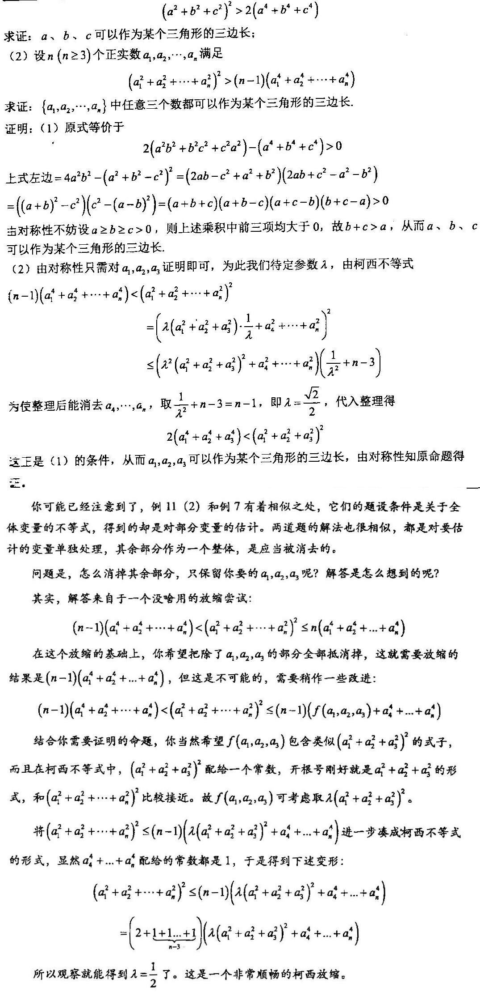

检索字：kexibudengshi；Cauchy不等式；Cauchy inequality

## 前置知识

[和式](heshi.md)

Note:为了避免理解上的困难，对于简单的求和会**尽量**避开$\sum\limits_{cyc}$、$\sum\limits_{sym}$等标记。但我们仍建议首先学习这些常用记号，它们被广泛地使用在各类文献中。

## 概念

### 基本定义

给定两组实数$\{a_n\},\{b_n\}\in\textbf{R}$，则有：

$$
(\sum a_jb_j)^2\le(\sum a_j^2)(\sum b_j^2)
$$

上式称为**柯西不等式**。当且仅当$a_j$全为0或$\exists \lambda\in\textbf{R}$使$b_j=\lambda a_j$。

### 证明

**法一**

$a_j$全为0时显然成立。否则$\sum a_j^2\not=0$。

注意到不等式为$A^2\le BC$的形式，根据初中的二次函数套路，不难想到设$f(t)=Bt^2+(2A)t+C$，并证明$f(t)\ge0$，则有$\Delta=(2A)^2-4BC\le0$即$A^2\le BC$。

故构造函数

$$
f(t)=(\sum a_j^2)t^2-2(\sum a_jb_j)x+\sum b_j^2=\sum(a_jx-b_j)^2\ge0
$$

从而得证。

**法二**

利用[拉格朗日恒等式](lagelangrihengdengshi.md):$(\sum a_j^2)(\sum b_j^2)-(\sum a_jb_j)^2=\sum\limits_{1\le i<j\le n}(a_ib_j-a_jb_i)^2\ge0$

从而得证。

**法三**

利用均值不等式。$\dfrac{a_j^2}{\sum a_j^2}+\dfrac{b_j^2}{\sum b_j^2}\ge\dfrac{2|a_jb_j|}{\sqrt{(\sum a_j^2)(\sum b_j^2)}}$

左右两侧分别对$j=1,2,...,n$求和，得到

$$
1+1\ge\dfrac{2\sum|a_jb_j|}{\sqrt{(\sum a_j^2)(\sum b_j^2)}}
$$

从而得证。

### 推论

**推论1** 设$b_j>0,a_j\in\textbf{R}$，则：

$$
\sum\dfrac{a_j^2}{b_j}\ge\dfrac{(\sum a_j)^2}{\sum b_j}\tag{1}
$$

**推论2** 设$\{a_n\},\{b_n\}\in\textbf{R}$，则：

$$
\sum\sqrt{a_j^2+b_j^2}\ge\sqrt{(\sum a_j)^2+(\sum b_j)^2}\tag{2}
$$

**推论3** 升幂方法

$$
\sum\dfrac{a_j}{b_j}\ge\dfrac{(\sum a_j)^2}{\sum a_jb_j}\tag{3}
$$

取等当且仅当$b_1=...=b_n$。

*注：a非零时，推论3与推论1等价。不建议直接使用推论3，而是在推论3的左侧分子分母都乘上一个$a_j$，再使用推论1。这是因为推论1是个常用的结论，它有自己的名字，叫做权方和不等式。而推论3仅仅是为了方便。在联赛中直接使用推论3，阅卷人可能会认为这是使用推论1时的跳步。当然，竞赛中容许适当的跳步，但最好养成严谨的习惯，以免被扣冤枉分。*

### 推广：卡尔松不等式

设$m,n\in\textbf{N}^*$，且有一数表$a_{ij}$，则：

$$
\prod_i(\sum_ja_{ij})\ge(\sum_j(\prod_ia_{ij})^{1/m})^m\tag{4}
$$

*附带指出，将柯西写成这样的形式有时会更方便处理。即*

$$
(a_1+...+a_n)(b_1+...+b_n)\ge(\sqrt{a_1b_1}+...+\sqrt{a_nb_n})^2\tag{5}
$$

#### 证明

套用$AM\ge GM$的证明方法（柯西归纳法）即可解决。请读者自行完成作为练习。

## 方法

### 判别式法

之前提到过，$A^2\le BC$的形式的不等式可以考虑构造函数来完成。设$f(t)=Bt^2+(2A)t+C$，并证明$f(t)\ge0$，则有$\Delta=(2A)^2-4BC\le0$即$A^2\le BC$。

**例1** 已知数表$a_{ij}$，且$a_{ij}=a_{ji}$，且$\forall x_1,...,x_n\in\textbf{R}$均有$\sum\limits_{1\le i,j\le n}a_{ij}x_ix_j\ge0$，当且仅当$x_1=...=x_n=0$时取等。求证：

$$
(\sum\limits_{1\le i,j\le n}a_{ij}x_iy_j)^2\le(\sum\limits_{1\le i,j\le n}a_{ij}x_ix_j)(\sum\limits_{1\le i,j\le n}a_{ij}y_iy_j)
$$

**证明**

构造二次函数$f(t)=(\sum\limits_{1\le i,j\le n}a_{ij}x_ix_j)t^2-2(\sum\limits_{1\le i,j\le n}a_{ij}x_iy_j)t+(\sum\limits_{1\le i,j\le n}a_{ij}y_iy_j)$。

则有

$$
\begin{matrix}
f(t)&=&(\sum\limits_{1\le i,j\le n}a_{ij}x_ix_j)t^2-(\sum\limits_{1\le i,j\le n}a_{ij}x_iy_j)t-(\sum\limits_{1\le i,j\le n}a_{ji}x_jy_i)t+(\sum\limits_{1\le i,j\le n}a_{ij}y_iy_j)\\
&=&(\sum\limits_{1\le i,j\le n}a_{ij}x_ix_j)t^2-(\sum\limits_{1\le i,j\le n}a_{ij}x_iy_j)t-(\sum\limits_{1\le i,j\le n}a_{ij}x_jy_i)t+(\sum\limits_{1\le i,j\le n}a_{ij}y_iy_j)\\
&=&\sum\limits_{1\le i,j\le n}a_{ij}(x_it-y_i)(x_jt-y_j)
\end{matrix}
$$

令$z_i=x_it-y_i$，由题设条件知$f(t)\ge0$。

从而得证。

### 柯西的基本用法

柯西不等式，其实是为**和的平方**到**平方的和**的放缩关系提供了一个思路。而根据项数来看，大多数情况下后者更利于处理。

处理形如平方和和一次的表达式之间的大小关系，这是最基本的柯西不等式用法。

比如以下的两题：

**例2** $a^2+b^2+c^2=14$，求$a+2b+3c$的取值范围。

**证明**

有$(a+2b+3c)^2\le(a^2+b^2+c^2)(1^2+2^2+3^2)=14^2$，故$a+2b+3c\in[-14,14]$。

**例3** $a+b+c+d=3,a^2+2b^2+3c^2+6d^2=5$，求证：$a\in[1,2]$。

**证明**

由柯西不等式，$(\dfrac12+\dfrac13+\dfrac16)(2b^2+3c^2+6d^2)\ge(b+c+d)^2$，即$5-a^2\ge(3-a)^2$。故$a\in[1,2]$。

**例4** 设$\{x_n\}\in\textbf{R}$，求证：$\sum\limits_{1\le j\le n}\dfrac{x_j}{1+\sum\limits_{1\le k\le j}x_k^2}<\sqrt n$。

**证明**

右侧的$\sqrt n$看起来很突兀，很难想象这个根号是如何来的。因此我们将两侧平方，是一个十分自然的做法。

*请记住这个思想：遇到很奇怪的元素、条件之类，思考它们在计算过程中将会如何出现，对解题有指导性作用。*

因而我们将两侧平方。即要证$LHS^2<n$

和式的平方如果暴力展开，式子的复杂度会激增。故我们利用柯西不等式放为平方的和。

有$LHS^2<(1+1+...+1)\sum\limits_{1\le j\le n}(\dfrac{x_j}{1+\sum\limits_{1\le k\le j}x_k^2})^2=n\sum\limits_{1\le j\le n}(\dfrac{x_j}{1+\sum\limits_{1\le k\le j}x_k^2})^2$

利用非常常见的放缩思路来裂项处理：$\dfrac{x_j^2}{(1+\sum\limits_{1\le k<j}x_k^2)(1+\sum\limits_{1\le k\le j}x_k^2)}>(\dfrac{x_j}{1+\sum\limits_{1\le k\le j}x_k^2})^2$

显然$\dfrac{x_j^2}{(1+\sum\limits_{1\le k<j}x_k^2)(1+\sum\limits_{1\le k\le j}x_k^2)}=\dfrac1{1+\sum\limits_{1\le k<j}x_k^2}-\dfrac1{1+\sum\limits_{1\le k\le j}x_k^2}$。

由裂项相消的求和结果，有$\sum\limits_{1\le j\le n}(\dfrac{x_j}{1+\sum\limits_{1\le k\le j}x_k^2})^2<1$。

故原命题成立。

### 消分母与分式合并

**例5** 若$a,b,c>0$，求证：$\dfrac{c}{a+b}+\dfrac{a}{b+c}+\dfrac{b}{c+a}\ge\dfrac32$

**证明**

考虑利用柯西不等式的推论合并分式。为了避免出现根号，考虑使用推论3。

则

$$
LHS\ge\dfrac{(a+b+c)^2}{2(ab+bc+ca)}\ge\dfrac32
$$

读者不妨从取等条件的角度思考一下，为何本题难以使用常规的均值不等式方法消去分母。

*当然，柯西不等式是可以由均值不等式推出的，因此从某种意义上本题可以使用均值来证。*

**例6** 若$a,b,c\in\textbf{R}^*$满足$ab+bc+ca=\dfrac13$，求证：

$$
\dfrac a{a^2-bc+1}+\dfrac b{b^2-ca+1}+\dfrac c{c^2-ab+1}\ge\dfrac1{a+b+c}
$$

**证明**

依然利用推论3。

$$
\begin{matrix}
LHS&\ge&\dfrac{(a+b+c)^2}{a^3+b^3+c^3+a+b+c-3abc}\\
&=&\dfrac{(a+b+c)^2}{(a+b+c)(a^2+b^2+c^2-ab-bc-ca)+a+b+c}\\
&=&\dfrac{a+b+c}{a^2+b^2+c^2-ab-bc-ca+1}=\dfrac{a+b+c}{a^2+b^2+c^2+2(ab+bc+ca)}\\
&=&\dfrac1{a+b+c}=RHS
\end{matrix}
$$

此外，我们常会遇见带有根号的分母。此时仅用柯西难以得到令人满意的处理方法，因为这样总是会不可避免地引入新的根号。在此类情况下，利用卡尔松不等式消去分母是一个较好的方案。

**例7**  设和为1的正实数$a,b,c$，求证$\dfrac a{\sqrt{b^2+c}}+\dfrac b{\sqrt{c^2+a}}+\dfrac c{\sqrt{a^2+b}}\ge\dfrac32$

**证明**

$$
(\sum_{cyc}\dfrac a{\sqrt{b^2+c}})(\sum_{cyc}\dfrac a{\sqrt{b^2+c}})(\sum_{cyc}a(b^2+c))\ge(a+b+c)^3=1
$$

故只需证

$$
\sum_{cyc}a(b^2+c)\le\dfrac49
$$

将其齐次化（这是一个非常常用的思想，参见[齐次化](qicihua.md)），即等价于

$$
\sum_{cyc}a(b^2+c(a+b+c))\le\dfrac49(a+b+c)^3
$$

即

$$
4(a^3+b^3+c^3)+3(a^2b+b^2c+c^2a)\ge3abc+6(ab^2+bc^2+ca^2)
$$

即

$$
(a^3+b^3+c^3)+3(b^3+a^2b+c^3+b^2c+a^3+c^2a)\ge3abc+6(ab^2+bc^2+ca^2)
$$

而这是由均值不等式显然的。

### 拆根式

在初中时，教师常强调，形如$\sqrt{x^2+y^2}=x+y$一类的化简是错误的，尽管它们有时会非常简便。

但利用柯西不等式，我们可以寻找一个不等关系，能够将$\sqrt{x^2+y^2}$放缩为$\dfrac{\sqrt mx+\sqrt ny}{\sqrt{m+n}}$之形式。

有如下结论：

$$
\sqrt{x^2+y^2}\ge\dfrac{\sqrt mx+\sqrt ny}{\sqrt{m+n}}
$$

其中$m,n\ge0$且不同时为0。

**证明**

$$
x^2+y^2=\dfrac1{m+n}(x^2+y^2)(m+n)\ge\dfrac{(\sqrt mx+\sqrt ny)^2}{m+n}
$$

两边同时开方即证。

**例8** $x,y\ge0,2x+y=1$，求$\min(x+\sqrt{x^2+y^2})$。

**证明**

待处理的式子是个一次式，但其中出现了根号。为了利用到条件，首先拆除根号，使待处理的式子放缩为一次整式。即$ax+by$之形式。

$$
x+\sqrt{x^2+y^2}\ge x+\dfrac{\sqrt mx+\sqrt nx}{\sqrt{m+n}}=(1+\dfrac{\sqrt m}{\sqrt{m+n}})x+\dfrac{\sqrt n}{\sqrt{m+n}}y
$$

为了利用条件，我们希望x和y的系数为$2:1$，这样刚好就能表成$2x+y$的常数倍。解方程得到$m=\dfrac9{16}n$，此时$LHS\ge\dfrac85x+\dfrac45y=\dfrac45$。取等条件即$x=\dfrac9{11},y=\dfrac3{11}$。

### 符号与不等式方向的处理方法

这一部分主要针对两个问题：

- 一部分正项，一部分负项。此时不能轻率地运用均值不等式。此时可以考虑正负分离（分别移到不等式两侧）、两侧同时补上常数等方法。
- 不等号方向与基本不等式的方向不符。

**例9** 设$a,b,c\in\textbf{R}$，求证：$\sum\limits_{cyc}\dfrac{a^2-bc}{2a^2+b^2+c^2}\ge0$

**证明**

考虑不等式两侧同时减去$\dfrac12$，再简单移项得，原不等式等价于$\sum\limits_{cyc}\dfrac{(b+c)^2}{2a^2+b^2+c^2}\le3$。

但这个不等式不够显然，因为其不等号方向并非$\ge$，消分母的思路便不再可行。注意到分子是和的平方，由柯西的基本思路，可以考虑套用推论3。而分母即自然地拆成了$a^2+b^2$和$a^2+c^2$。

故由柯西不等式显然有$\dfrac{(b+c)^2}{2a^2+b^2+c^2}\le\dfrac{b^2}{a^2+b^2}+\dfrac{c^2}{a^2+c^2}$，三式相加则原不等式显然成立。

### 适当收紧

**例10** 设实数序列$\{a_n\}$满足$(\sum a_j)(\sum \dfrac1{a_j})\le(n+\dfrac12)^2$，求证$\max\{a_n\}\le4\min\{a_n\}$。

**证明**

依然是之前提到的重要思想：对突兀的元素思考它们在计算过程中将会如何出现。我们对这个序列的最大值和最小值一无所知，甚至不知道它们所在的位置。因而为了方便处理，自然地假设
$$
minv=a_1\le a_2\le...\le a_n=maxv
$$
其中$minv=\min\{a_n\},maxv=\max\{a_n\}$。

由柯西不等式
$$
(n+\dfrac12)^2\ge(\sum a_j)(\sum \dfrac1{a_j})=n^2
$$
这显然放过了。

我们需要注意到这样一个事实：柯西的取等条件是比值全相等。事实上比值越接近，不等式就越紧。而$\{a_j\}$和$\{\dfrac1{a_j}\}$增减性完全相反，它们的比值也将相差甚远。

为了使不等式更加紧凑，我们考虑反转$\{\dfrac1{a_j}\}$。但这样会得到$\sum\sqrt{\dfrac{a_j}{a_{j-1}}}$形式的式子，它十分棘手。

棘手的原因就在于，我们对中间的诸a一无所知。

因而自然地想到，目前我们了解得最多的a值，便是$minv=a_1$和$maxv=a_n$，我们甚至知道它们在a中的准确位置。因而考虑仅调换$minv,maxv$：
$$
\begin{matrix}
(n+\dfrac12)^2&\ge&(minv+...+maxv)(\dfrac1{maxv}+a_2+...+a_{n-1}+\dfrac1{minv})\\
&\ge&(\sqrt{\dfrac{minv}{maxv}}+1+...+1+\sqrt{\dfrac{maxv}{minv}})^2
\end{matrix}
$$
最终我们得到$\sqrt{minv/maxv}+\sqrt{maxv/minv}\le\dfrac52$。整理后得证。

### 非对称不等式

我们依然以创知路书中一处非常精妙的讲解来收尾。

（此题亦出现于爱尖子的课程中）

**例11** 若正实数序列$\{a_n\}$满足$(\sum a_j^2)^2>(n-1)(\sum a_j^4)$，求证：$\{a_n\}$中任意三个数都可作为某三角三边。

**证明**

